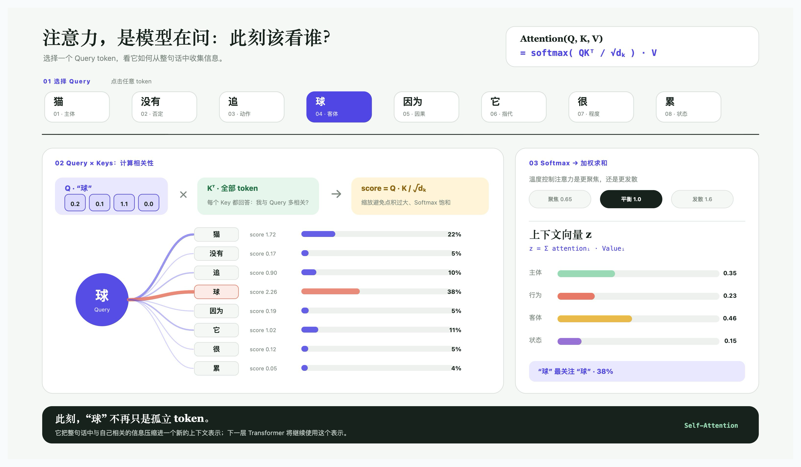

# qiaomu-tldraw-skill

**中文** | [English](#english)



> 把一句需求、草图或参考图，交付为真实可编辑、可交互、可验证的 tldraw 画布或 SDK 应用。
>
> Turn a brief, sketch, or reference into an editable, interactive, verified tldraw canvas or SDK app.

[](LICENSE)
[](SKILL.md)

**v1.1 官方整合版：** tldraw offline Canvas API、官方 `create-tldraw` CLI、`llms.txt` 文档族、SDK migration sources、包验证、真实交互画布与公开回装统一在一个 skill 内。无需社区 skill 或第三方 CLI 包装器。

## 为什么值得用

很多 tldraw 提示词只会“说怎么画”，或生成一张看起来像画布的扁平图片。这个 skill 关注最终交付：选得中、改得动、连线有 binding、脚本能重开、按钮真的会改变持久状态，而且有截图和检查结果可以复核。

它把四类能力接成一条稳定路径：

- tldraw offline 的真实文件与本地 Canvas API；
- 原生 shape、document script、custom `ShapeUtil` 的交互画布；
- 官方 `create-tldraw` CLI 生成的 React / TypeScript SDK 应用；
- tldraw 官方 `llms-*.txt` 文档的同步、哈希、离线搜索与迁移检索。

## 一行安装

```bash
npx skills add joeseesun/qiaomu-tldraw-skill -g -y
```

验证：

```bash
test -f ~/.agents/skills/qiaomu-tldraw-skill/SKILL.md
python3 ~/.agents/skills/qiaomu-tldraw-skill/scripts/qiaomu_tldraw.py doctor
```

## 你可以直接这样说

- “用 qiaomu-tldraw-skill 把这个流程做成可编辑的 tldraw 图，连线必须真实绑定。”
- “把这张截图复刻成 PPT 可继续编辑的 tldraw 画布，并给我同裁切对比截图。”
- “在当前 tldraw 文件里做一个可点击的注意力机制演示，重开后仍能工作。”
- “用官方 CLI 建一个 tldraw workflow starter，再改造成我的可视化应用。”
- “同步 tldraw 官方 docs，查当前 ShapeUtil 和 bindings 的正确写法。”
- “把这个 tldraw SDK 项目升级到最新版，只依据官方 releases 和类型定义迁移。”
- “检查这个 `.tldraw` 的脚本、未知 shapes、lint、可编辑性和发布风险。”

## 核心能力

| 能力 | 你得到什么 |
|---|---|
| 原生可编辑画布 | 文本、图形、分组、frame 和真实 bindings，而不是一张背景图 |
| 参考图复刻 | 以真实像素、构图、裁切和颜色为依据的语义化重建 |
| 交互与动画 | 状态写入 props、脚本 applied、真实事件和重开验证 |
| Canvas API 工作流 | 精确发现目标文档、读 records、执行、截图、lint 与保存 |
| 官方 CLI | 查看当前 templates、dry-run、创建 starter、检查生成项目 |
| 官方文档 | 同步 `llms` 文档族、记录 SHA-256、在本机离线搜索 |
| SDK 应用与迁移 | 官方 starter、releases、类型/构建/浏览器验证路径 |
| 恢复与治理 | 多窗口误写保护、冷注册策略、secret scan、回滚边界 |

## 前置条件

- [ ] Node.js 满足当前 `create-tldraw` 要求：`node --version`
- [ ] Python 3.10+：`python3 --version`
- [ ] 创作本地 `.tldraw` 时已安装并启动 [tldraw offline](https://offline.tldraw.com/)
- [ ] live 画布任务已启动 tldraw offline；运行 `python3 scripts/qiaomu_tldraw.py doctor`
- [ ] 需要新 SDK 项目时可运行：`npx create-tldraw@latest --help`

本 skill 不需要云端 API key。图像生成、联网资料或 AI starter kit 可能需要第三方模型凭据与费用；它们不应写入画布、日志或仓库。

## 零额外第三方依赖

- skill 自带的 Python 工具只使用标准库；无需 `requests`、PyYAML、jq 或额外 pip 安装。
- SDK scaffold 只调用 tldraw 官方 npm 包 `create-tldraw`；官方包自身的传递依赖由其发布物管理。
- wrapper 显式使用 `registry.npmjs.org`，不会静默继承本机的第三方 npm mirror。
- SDK 文档只从 `tldraw.dev` 获取，package metadata 只从 `registry.npmjs.org` 获取。
- live canvas 通过自带标准库 client 访问 tldraw offline loopback API，不要求任何社区创作/复刻 skill。
- 默认关闭官方 CLI telemetry；需要开启时由用户明确选择。

这里的“零额外第三方依赖”指 Skill 自身的运行工具和路由链路。官方 tldraw SDK starter 仍然是 npm 应用，会安装其 `package.json` 声明的官方项目依赖；本 Skill 不会伪称那些依赖不存在。

## 它会怎么工作

1. 识别交付面：已有画布、新建文件、参考图复刻、document script 或 SDK 应用。
2. 锁定真实文档身份、页面、选择区和边界。
3. 读取运行中应用的 `/readme` / recipe，或同步官方 `llms` docs、examples、releases。
4. 用原生 shape 优先实现；只有真正的交互、动画或算法图形才升级到 custom shape。
5. 运行 records、bindings、lint、脚本、视觉、交互和重开门禁。
6. 返回文件、截图、可编辑范围、验证证据和 `missing evidence`。

## 示例输出

```text
Canvas: /path/to/attention-demo.tldraw
Editable: one custom dashboard shape; state stored in shape props
Verified: script=applied, lints=0, selectedToken 5→0, temperature 1→1.6
Visual proof: docs/assets/product-screenshot.png
Missing evidence: Windows/Linux Canvas API smoke test
```

示例脚本见 [`examples/`](examples/README.md)。

## 官方 CLI 与文档已经集成

安装本 skill 后直接使用：

```bash
# 官方来源、当前 CLI 版本、Node engine、templates 与 docs URL
python3 scripts/qiaomu_tldraw.py official-info

# 官方 CLI
python3 scripts/qiaomu_tldraw.py cli-help
python3 scripts/qiaomu_tldraw.py scaffold ./my-canvas --template basic --dry-run
python3 scripts/qiaomu_tldraw.py scaffold ./my-canvas --template basic

# 官方 agent-friendly 文档
python3 scripts/qiaomu_tldraw.py docs-sync \
  --bundle index --bundle docs --bundle examples --bundle releases
# 官方完整合并文档，仅在需要全量上下文时同步
python3 scripts/qiaomu_tldraw.py docs-sync --bundle full
python3 scripts/qiaomu_tldraw.py docs-search "custom ShapeUtil" --bundle docs
python3 scripts/qiaomu_tldraw.py docs-search "Migration guide" --bundle releases

# 已有项目
python3 scripts/qiaomu_tldraw.py project-info ./my-canvas
```

默认文档 cache 位于 `~/.cache/qiaomu-tldraw-skill/official-docs/`，不提交进仓库。详细命令见 [Official CLI](references/official-cli.md)、[Official Docs](references/official-docs.md) 与 [Installation and Lineage](references/installation-lineage.md)。

## 验证

```bash
python3 scripts/validate_skill.py .
python3 scripts/trigger_eval.py . --output reports/trigger-eval.json
python3 scripts/export_skill_ir.py . --output reports/skill-ir.json
python3 scripts/security_scan.py . --output reports/trust-report.json
python3 scripts/dependency_audit.py . --output reports/dependency-audit.json
python3 -m unittest discover -s scripts -p 'test_*.py'
python3 scripts/qiaomu_tldraw.py doctor --json
python3 scripts/qiaomu_tldraw.py official-info --sync-docs --output reports/official-source-lock.json
```

视觉与交互属于人工/真实运行时门禁，不能由静态检查替代。当前证据记录在 [`reports/output_quality_scorecard.md`](reports/output_quality_scorecard.md)。

## 风险、隐私与边界

- Canvas API token 只应从本机运行时配置读取，并只发送到 `localhost`。
- `.tldraw` document script 是随文件打开执行的代码；只打开可信来源，分享时明确告知。
- tldraw offline 不是开源软件；本仓库不重新分发应用、运行时文档全文或内部数据库。
- tldraw SDK 使用 tldraw 自己的许可证；生产使用可能需要 license key。请阅读 [tldraw license](https://tldraw.dev/community/license)。
- 官方 `llms` 全文只缓存在用户机器；仓库仅保留 URL、大小和 hash 证据。
- MIT 只覆盖本仓库原创代码和文档，不改变任何上游许可证。
- 参考图、字体、品牌与素材的使用权由使用者确认。

## Troubleshooting

| 症状 | 常见原因 | 处理 |
|---|---|---|
| `server.json not found` | tldraw offline 未运行或未启用 Canvas API | 启动/更新应用，再跑 doctor |
| `401 Unauthorized` | 复用了上一次启动的 token | 使用本 Skill 内置客户端；它会在每次请求前重新读取本机运行时配置 |
| `Document not found` | 目标窗口关闭，doc id 已失效 | 重新列文档并核对名称、路径、`documentId`，不要写入别的窗口 |
| `script-status: pending` | watcher 还未应用 | 短暂轮询；若转 error，读取 `lastApplyError` / error log |
| `Some shapes unavailable` | custom type 未注册或旧类型残留 | 用新模块名与新 type 冷注册，迁移/删除旧记录后再重开 |
| 点击后读不到变化 | 事件或 React 提交是异步的 | 等待约 30–180 ms，再读 props 或截图 |
| `refusing non-official URL` | URL 不在官方白名单 | 只使用 `tldraw.dev` 或 `registry.npmjs.org` |
| `target directory is not empty` | scaffold 可能覆盖/自动改目录 | 换空目录，不使用强制覆盖 |
| SDK 工程不能构建 | Node、模板或 tldraw 版本变化 | 刷新 official-info/docs，运行项目 typecheck/build，并按官方 releases 迁移 |

## 贡献与安全

欢迎提交 issue 和 PR。先阅读 [CONTRIBUTING.md](CONTRIBUTING.md) 与 [SECURITY.md](SECURITY.md)。不要在公开 issue 粘贴 Canvas API token、私有画布或本机数据库。

## 致谢与来源

- [tldraw offline](https://github.com/tldraw/tldraw-offline)：桌面文件、Canvas API 与 document scripts。
- [tldraw/tldraw](https://github.com/tldraw/tldraw)：SDK、`create-tldraw`、starter kits、release migration guides。
- [tldraw LLM documentation](https://tldraw.dev/docs/llm-docs)：官方 `llms.txt`、docs、examples、releases 与 full exports。
- `qiaomu-meta-skill`：Skill IR、触发评估、公开发布与治理门禁；方法上受到 `yaojingang/yao-meta-skill` 启发。

## 关于向阳乔木

- 网站：[qiaomu.ai](https://qiaomu.ai/)
- 博客：[blog.qiaomu.ai](https://blog.qiaomu.ai/)
- 推荐：[tuijian.qiaomu.ai](https://tuijian.qiaomu.ai/)
- X：[@vista8](https://x.com/vista8)
- GitHub：[@joeseesun](https://github.com/joeseesun/)

Copyright (c) 向阳乔木 · [MIT](LICENSE)

---

<a name="english"></a>

# English

`qiaomu-tldraw-skill` turns a brief, sketch, reference image, or application idea into a real editable tldraw canvas or SDK app. It integrates tldraw's official CLI, official LLM-friendly docs, live offline Canvas API, native editable shapes, durable scripts, SDK migration sources, visual proof, and recovery in one skill.

## Install

```bash
npx skills add joeseesun/qiaomu-tldraw-skill -g -y
python3 ~/.agents/skills/qiaomu-tldraw-skill/scripts/qiaomu_tldraw.py doctor
```

## Example prompts

- “Build an editable tldraw architecture diagram with real bound arrows.”
- “Recreate this slide as editable tldraw shapes and show a same-crop comparison.”
- “Create a clickable attention-mechanism demo that still works after reopening.”
- “Scaffold a tldraw workflow app with the official CLI and verify its build.”
- “Sync the official tldraw docs and find the current ShapeUtil pattern.”

## Verified scope and limits

The bundled Python runtime uses the standard library only. It allows only official tldraw documentation and npm metadata hosts, disables create-tldraw telemetry by default, and does not require community skills or third-party CLI wrappers. Verified versions and source hashes are recorded in `reports/official-source-lock.json`; unsupported platforms and untested starter kits remain `missing evidence`.

The MIT license covers only this repository's original code and documentation. tldraw offline, the tldraw SDK, official starter repositories, model providers, fonts, and reference media retain their own terms. See [Security and Governance](references/security-governance.md) and [Installation and Lineage](references/installation-lineage.md).
